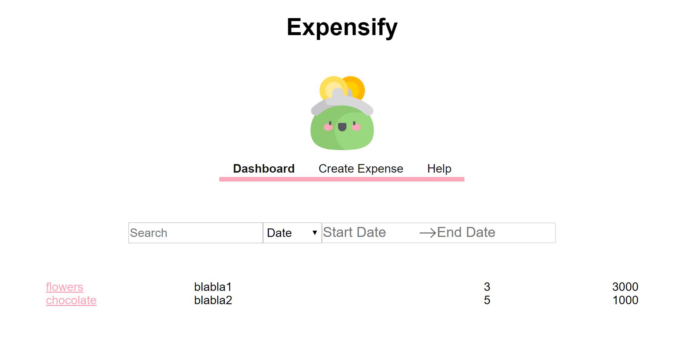
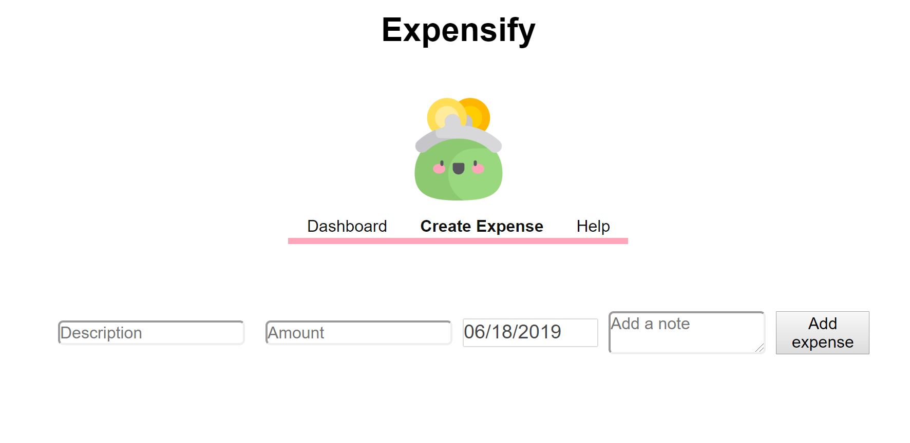

# 💰 expensify

**expensify** is an app built with React, Redux, Sass, Jest, Express and Webpack. A live version is available [here](https://radiant-lowlands-17325.herokuapp.com/).

## Installation

Clone the project and use the package manager npm to install expensify and its dependencies.

## Usage

* New expenses can be added into the list.
* Expenses can be deleted individually.
* Expenses can be modified individually.
* The list of expenses can be filtered by name and date.
* The list of expenses can be sorted by amount or by date.

## Contributing
To do:
- [ ] clean non-used packages
- [ ] test React components
- [ ] change the format of dates
- [ ] set up firebase
- [ ] make the app more responsive

## License
[MIT](https://choosealicense.com/licenses/mit/)